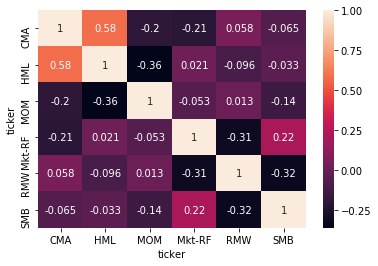

# Smart Beta Strategy

There are many different factors and smart beta strategies. In this report, I want to focus on how utilize the different portfolio construction.  
Previously, I have used data and platform from quantopian.com. This time, I have constructed my platform on Amazon Web Services(AWS) using Linux server along with MySQL database.  


```python

import pandas as pd
import numpy as np
import seaborn as sns
import matplotlib.pyplot as plt
%matplotlib inline
from ch_api import ch_optimize, util, ch_portfolio

import importlib
```


```python
USE_DB = True  # It DB connection is limited, let's use pickle files inluced in the repo not connecting DB
ID = ''
PW = ''
```


```python
import yaml
from sqlalchemy import create_engine


engine = create_engine('mysql+pymysql://%s:%s@localhost/securities_master' % 
                       (ID, PW), 
                       echo=False)
```

# Data

## Universe of SP 500
Daily price data of SP 500 are collected from yahoo finance.

## Factors

I used factors from the Fama_Frent 5 factor models and Momentum from the data library in the site (http://mba.tuck.dartmouth.edu/pages/faculty/ken.french/data_library.html)    
See this (http://mba.tuck.dartmouth.edu/pages/faculty/ken.french/Data_Library/f-f_5_factors_2x3.html) for 5 factor model and here (http://mba.tuck.dartmouth.edu/pages/faculty/ken.french/Data_Library/det_mom_factor.html) for momentum factor defiine.  


```python
if USE_DB:
    factors_ts = pd.read_sql("select * from symbol where instrument='factor' and ticker<>'RF'", engine)
    # factors data are available in the pickle file: %root%/input/factors.pkl
    #factors_ts.to_pickle("../data/factors.pkl")
else:
    factors_ts = pd.read_pickle('../data/factors.pkl')
    
tis = list(factors_ts['ticker'].values)

```


```python
# Factors
tis
```


    ['Mkt-RF', 'SMB', 'HML', 'RMW', 'CMA', 'MOM']


# Platform

Python 3.7 and CVXPY are the key components. Please refer to the file %project_root%/python_environment.txt


<div class='tableauPlaceholder' id='viz1537868435072' style='position: relative'><noscript><a href='#'></a></noscript><object class='tableauViz'  style='display:none;'><param name='host_url' value='https%3A%2F%2Fpublic.tableau.com%2F' /> <param name='embed_code_version' value='3' /> <param name='site_root' value='' /><param name='name' value='Exposures_1&#47;Overview' /><param name='tabs' value='no' /><param name='toolbar' value='yes' /><param name='static_image' value='https:&#47;&#47;public.tableau.com&#47;static&#47;images&#47;Ex&#47;Exposures_1&#47;Overview&#47;1.png' /> <param name='animate_transition' value='yes' /><param name='display_static_image' value='yes' /><param name='display_spinner' value='yes' /><param name='display_overlay' value='yes' /><param name='display_count' value='yes' /></object></div>                <script type='text/javascript'>                    var divElement = document.getElementById('viz1537868435072');                    var vizElement = divElement.getElementsByTagName('object')[0];                    vizElement.style.width='100%';vizElement.style.height=(divElement.offsetWidth*0.75)+'px';                    var scriptElement = document.createElement('script');                    scriptElement.src = 'https://public.tableau.com/javascripts/api/viz_v1.js';                    vizElement.parentNode.insertBefore(scriptElement, vizElement);                </script>


<div class='tableauPlaceholder' id='viz1537868435072' style='position: relative'><noscript><a href='#'></a></noscript><object class='tableauViz'  style='display:none;'><param name='host_url' value='https%3A%2F%2Fpublic.tableau.com%2F' /> <param name='embed_code_version' value='3' /> <param name='site_root' value='' /><param name='name' value='Exposures_1&#47;Overview' /><param name='tabs' value='no' /><param name='toolbar' value='yes' /><param name='static_image' value='https:&#47;&#47;public.tableau.com&#47;static&#47;images&#47;Ex&#47;Exposures_1&#47;Overview&#47;1.png' /> <param name='animate_transition' value='yes' /><param name='display_static_image' value='yes' /><param name='display_spinner' value='yes' /><param name='display_overlay' value='yes' /><param name='display_count' value='yes' /></object></div>                <script type='text/javascript'>                    var divElement = document.getElementById('viz1537868435072');                    var vizElement = divElement.getElementsByTagName('object')[0];                    vizElement.style.width='100%';vizElement.style.height=(divElement.offsetWidth*0.75)+'px';                    var scriptElement = document.createElement('script');                    scriptElement.src = 'https://public.tableau.com/javascripts/api/viz_v1.js';                    vizElement.parentNode.insertBefore(scriptElement, vizElement);                </script>


# Beta, Loading, and Covariance

For this project, I used 250-day lookback period for rolling daily loading value of Beta, factor loadings, and covarianace/correlation computation.  
See  
%project_root%/clients/market_beta.py  
%project_root%/clients/factor_loading.py  

# Factors Performance & Correlation


```python

start_date = '2012-01-02'
end_date = '2018-08-24'

if USE_DB:
    stm = "select * from daily_price where ticker in %s and instrument_type='factor'" % str(tuple(tis))
    factors_ts = pd.read_sql(stm, engine)

    factors_ts = factors_ts[['price_date', 'ticker', 'adj_close_price']]
    idx = (factors_ts['price_date']>=start_date) & (factors_ts['price_date']<=end_date)

    df_sliced = factors_ts[idx].copy()
    df_sliced.set_index(['price_date', 'ticker'],inplace=True)
    factors_unstacked = df_sliced.unstack(level=-1)
    factors_unstacked_aligned = factors_unstacked.dropna()
    #factors_unstacked_aligned.to_pickle("../data/factors_return.py")
else:
    factors_unstacked_aligned = pd.read_pickle("../data/factors_return.py")

```


```python
factors_unstacked_aligned.head()
```


<div>
<style scoped>
    .dataframe tbody tr th:only-of-type {
        vertical-align: middle;
    }

    .dataframe tbody tr th {
        vertical-align: top;
    }

    .dataframe thead tr th {
        text-align: left;
    }

    .dataframe thead tr:last-of-type th {
        text-align: right;
    }
</style>
<table border="1" class="dataframe">
  <thead>
    <tr>
      <th></th>
      <th colspan="6" halign="left">adj_close_price</th>
    </tr>
    <tr>
      <th>ticker</th>
      <th>CMA</th>
      <th>HML</th>
      <th>MOM</th>
      <th>Mkt-RF</th>
      <th>RMW</th>
      <th>SMB</th>
    </tr>
    <tr>
      <th>price_date</th>
      <th></th>
      <th></th>
      <th></th>
      <th></th>
      <th></th>
      <th></th>
    </tr>
  </thead>
  <tbody>
    <tr>
      <th>2012-01-03</th>
      <td>-0.0021</td>
      <td>0.0087</td>
      <td>-0.0261</td>
      <td>0.0150</td>
      <td>-0.0067</td>
      <td>-0.0010</td>
    </tr>
    <tr>
      <th>2012-01-04</th>
      <td>-0.0005</td>
      <td>0.0009</td>
      <td>0.0012</td>
      <td>0.0000</td>
      <td>0.0026</td>
      <td>-0.0063</td>
    </tr>
    <tr>
      <th>2012-01-05</th>
      <td>0.0008</td>
      <td>0.0014</td>
      <td>-0.0058</td>
      <td>0.0039</td>
      <td>-0.0038</td>
      <td>0.0020</td>
    </tr>
    <tr>
      <th>2012-01-06</th>
      <td>-0.0004</td>
      <td>-0.0026</td>
      <td>-0.0006</td>
      <td>-0.0019</td>
      <td>-0.0004</td>
      <td>-0.0004</td>
    </tr>
    <tr>
      <th>2012-01-09</th>
      <td>0.0025</td>
      <td>-0.0005</td>
      <td>-0.0034</td>
      <td>0.0028</td>
      <td>-0.0021</td>
      <td>0.0027</td>
    </tr>
  </tbody>
</table>
</div>


```python
factors_unstacked_aligned = factors_unstacked_aligned['adj_close_price'].copy()
```


```python
factors_unstacked_aligned_cum = np.cumprod(factors_unstacked_aligned + 1.0) - 1.0
factors_unstacked_aligned_cum.to_csv("../output/factors_cum_returns.csv")
```


<div class='tableauPlaceholder' id='viz1537757097012' style='position: relative'><noscript><a href='#'></a></noscript><object class='tableauViz'  style='display:none;'><param name='host_url' value='https%3A%2F%2Fpublic.tableau.com%2F' /> <param name='embed_code_version' value='3' /> <param name='site_root' value='' /><param name='name' value='FactorAnalysis1&#47;Factor_Perf' /><param name='tabs' value='no' /><param name='toolbar' value='yes' /><param name='static_image' value='https:&#47;&#47;public.tableau.com&#47;static&#47;images&#47;Fa&#47;FactorAnalysis1&#47;Factor_Perf&#47;1.png' /> <param name='animate_transition' value='yes' /><param name='display_static_image' value='yes' /><param name='display_spinner' value='yes' /><param name='display_overlay' value='yes' /><param name='display_count' value='yes' /><param name='filter' value='publish=yes' /></object></div>                <script type='text/javascript'>                    var divElement = document.getElementById('viz1537757097012');                    var vizElement = divElement.getElementsByTagName('object')[0];                    vizElement.style.width='100%';vizElement.style.height=(divElement.offsetWidth*0.75)+'px';                    var scriptElement = document.createElement('script');                    scriptElement.src = 'https://public.tableau.com/javascripts/api/viz_v1.js';                    vizElement.parentNode.insertBefore(scriptElement, vizElement);                </script>


<div class='tableauPlaceholder' id='viz1537757097012' style='position: relative'><noscript><a href='#'></a></noscript><object class='tableauViz'  style='display:none;'><param name='host_url' value='https%3A%2F%2Fpublic.tableau.com%2F' /> <param name='embed_code_version' value='3' /> <param name='site_root' value='' /><param name='name' value='FactorAnalysis1&#47;Factor_Perf' /><param name='tabs' value='no' /><param name='toolbar' value='yes' /><param name='static_image' value='https:&#47;&#47;public.tableau.com&#47;static&#47;images&#47;Fa&#47;FactorAnalysis1&#47;Factor_Perf&#47;1.png' /> <param name='animate_transition' value='yes' /><param name='display_static_image' value='yes' /><param name='display_spinner' value='yes' /><param name='display_overlay' value='yes' /><param name='display_count' value='yes' /><param name='filter' value='publish=yes' /></object></div>                <script type='text/javascript'>                    var divElement = document.getElementById('viz1537757097012');                    var vizElement = divElement.getElementsByTagName('object')[0];                    vizElement.style.width='100%';vizElement.style.height=(divElement.offsetWidth*0.75)+'px';                    var scriptElement = document.createElement('script');                    scriptElement.src = 'https://public.tableau.com/javascripts/api/viz_v1.js';                    vizElement.parentNode.insertBefore(scriptElement, vizElement);                </script>


```python
sns.heatmap(factors_unstacked_aligned.corr(), annot=True)
```


    <matplotlib.axes._subplots.AxesSubplot at 0x7f8f87d68f60>





# Overview Scenario

Value and Momentum is known as historically negative correlation. The target horizon for this analysis if from 2017/1/4 ~ 2017/12/30. During this period, Value factor was in downturn and Momentum factor return is going up while it was opposite during year 2016.  

First, I will construct 4 different portfolio for different goals but using same stocks with different weights scheme.  
There are four different portfolio constructed.  
- portfolio 1. Value long-only portfolio
- portfolio 2. Value + Momentum long-onluy portfolio
- portfolio 3. Equal weight long-only portfolio
- portfolio 4. Min Variance long-only portfolio

Since we already know that during 2017, value return was negative while momemtum and market were positive. The portfolio 1 is expected to be negative, but we will see how much the portfolio 2 which is combined with momentum will be helpful. All portfolio will be rebalanced daily.

# Base Portfoliio

The first baseline portfolio is equal weight portfolio with stocks randomly selected from each sector.  
Its asset level information is below:


<div class='tableauPlaceholder' id='viz1537829767797' style='position: relative'><noscript><a href='#'></a></noscript><object class='tableauViz'  style='display:none;'><param name='host_url' value='https%3A%2F%2Fpublic.tableau.com%2F' /> <param name='embed_code_version' value='3' /> <param name='site_root' value='' /><param name='name' value='EW_Portfolio_1&#47;PF1Dashboard' /><param name='tabs' value='no' /><param name='toolbar' value='yes' /><param name='static_image' value='https:&#47;&#47;public.tableau.com&#47;static&#47;images&#47;EW&#47;EW_Portfolio_1&#47;PF1Dashboard&#47;1.png' /> <param name='animate_transition' value='yes' /><param name='display_static_image' value='yes' /><param name='display_spinner' value='yes' /><param name='display_overlay' value='yes' /><param name='display_count' value='yes' /></object></div>                <script type='text/javascript'>                    var divElement = document.getElementById('viz1537829767797');                    var vizElement = divElement.getElementsByTagName('object')[0];                    vizElement.style.width='100%';vizElement.style.height=(divElement.offsetWidth*0.75)+'px';                    var scriptElement = document.createElement('script');                    scriptElement.src = 'https://public.tableau.com/javascripts/api/viz_v1.js';                    vizElement.parentNode.insertBefore(scriptElement, vizElement);                </script>


<div class='tableauPlaceholder' id='viz1537829767797' style='position: relative'><noscript><a href='#'></a></noscript><object class='tableauViz'  style='display:none;'><param name='host_url' value='https%3A%2F%2Fpublic.tableau.com%2F' /> <param name='embed_code_version' value='3' /> <param name='site_root' value='' /><param name='name' value='EW_Portfolio_1&#47;PF1Dashboard' /><param name='tabs' value='no' /><param name='toolbar' value='yes' /><param name='static_image' value='https:&#47;&#47;public.tableau.com&#47;static&#47;images&#47;EW&#47;EW_Portfolio_1&#47;PF1Dashboard&#47;1.png' /> <param name='animate_transition' value='yes' /><param name='display_static_image' value='yes' /><param name='display_spinner' value='yes' /><param name='display_overlay' value='yes' /><param name='display_count' value='yes' /></object></div>                <script type='text/javascript'>                    var divElement = document.getElementById('viz1537829767797');                    var vizElement = divElement.getElementsByTagName('object')[0];                    vizElement.style.width='100%';vizElement.style.height=(divElement.offsetWidth*0.75)+'px';                    var scriptElement = document.createElement('script');                    scriptElement.src = 'https://public.tableau.com/javascripts/api/viz_v1.js';                    vizElement.parentNode.insertBefore(scriptElement, vizElement);                </script>


# Portfolios
  
- Equal Weight (ew_pf_all)
- Mean Variance (MV)
- Value (Value)
- Value + Momentum (Value_Mom)

## 1. Baseline portfolio: Equal Weight Portfolio


```python
ew_portfolio_ts = pd.read_pickle('../output/ts_base_portfolio.pkl')
```


```python
ew_portfolio_ts.rename(columns={'metric_date': 'date'}, inplace=True)
ew_portfolio_ts.set_index(['date', 'ticker'], inplace=True)
```


```python
ew_portfolio_ts.head()
```


<div>
<style scoped>
    .dataframe tbody tr th:only-of-type {
        vertical-align: middle;
    }

    .dataframe tbody tr th {
        vertical-align: top;
    }

    .dataframe thead th {
        text-align: right;
    }
</style>
<table border="1" class="dataframe">
  <thead>
    <tr style="text-align: right;">
      <th></th>
      <th></th>
      <th>CMA</th>
      <th>HML</th>
      <th>MOM</th>
      <th>Mkt-RF</th>
      <th>RMW</th>
      <th>SMB</th>
      <th>beta</th>
      <th>daily_return</th>
      <th>inception_date</th>
      <th>name</th>
      <th>pf_name</th>
      <th>price</th>
      <th>sector</th>
      <th>weight</th>
    </tr>
    <tr>
      <th>date</th>
      <th>ticker</th>
      <th></th>
      <th></th>
      <th></th>
      <th></th>
      <th></th>
      <th></th>
      <th></th>
      <th></th>
      <th></th>
      <th></th>
      <th></th>
      <th></th>
      <th></th>
      <th></th>
    </tr>
  </thead>
  <tbody>
    <tr>
      <th rowspan="5" valign="top">2017-01-04</th>
      <th>UA</th>
      <td>-1.3362</td>
      <td>0.3133</td>
      <td>-0.9523</td>
      <td>0.8744</td>
      <td>-0.3100</td>
      <td>0.2990</td>
      <td>1.6032</td>
      <td>0.0314</td>
      <td>2017-01-04</td>
      <td>Under Armour Class C</td>
      <td>ew_pf_all</td>
      <td>26.5700</td>
      <td>Consumer Discretionary</td>
      <td>0.0141</td>
    </tr>
    <tr>
      <th>AAP</th>
      <td>0.4638</td>
      <td>-0.0423</td>
      <td>0.3011</td>
      <td>1.1246</td>
      <td>0.5644</td>
      <td>0.2373</td>
      <td>0.9311</td>
      <td>0.0082</td>
      <td>2017-01-04</td>
      <td>Advance Auto Parts</td>
      <td>ew_pf_all</td>
      <td>171.4716</td>
      <td>Consumer Discretionary</td>
      <td>0.0141</td>
    </tr>
    <tr>
      <th>KSS</th>
      <td>0.7001</td>
      <td>0.3590</td>
      <td>-0.0257</td>
      <td>0.8332</td>
      <td>0.9086</td>
      <td>1.2936</td>
      <td>0.9613</td>
      <td>0.0422</td>
      <td>2017-01-04</td>
      <td>Kohl's Corp.</td>
      <td>ew_pf_all</td>
      <td>47.7039</td>
      <td>Consumer Discretionary</td>
      <td>0.0141</td>
    </tr>
    <tr>
      <th>LEN</th>
      <td>-0.4864</td>
      <td>0.2597</td>
      <td>-0.1227</td>
      <td>1.1653</td>
      <td>0.7193</td>
      <td>0.3950</td>
      <td>1.2897</td>
      <td>0.0247</td>
      <td>2017-01-04</td>
      <td>Lennar Corp.</td>
      <td>ew_pf_all</td>
      <td>43.0236</td>
      <td>Consumer Discretionary</td>
      <td>0.0141</td>
    </tr>
    <tr>
      <th>DHI</th>
      <td>-0.6686</td>
      <td>0.2399</td>
      <td>0.1262</td>
      <td>1.4062</td>
      <td>0.4596</td>
      <td>0.3211</td>
      <td>1.4566</td>
      <td>0.0243</td>
      <td>2017-01-04</td>
      <td>D. R. Horton</td>
      <td>ew_pf_all</td>
      <td>27.6662</td>
      <td>Consumer Discretionary</td>
      <td>0.0141</td>
    </tr>
  </tbody>
</table>
</div>


```python
ew_portfolio_ts.tail()
```


<div>
<style scoped>
    .dataframe tbody tr th:only-of-type {
        vertical-align: middle;
    }

    .dataframe tbody tr th {
        vertical-align: top;
    }

    .dataframe thead th {
        text-align: right;
    }
</style>
<table border="1" class="dataframe">
  <thead>
    <tr style="text-align: right;">
      <th></th>
      <th></th>
      <th>CMA</th>
      <th>HML</th>
      <th>MOM</th>
      <th>Mkt-RF</th>
      <th>RMW</th>
      <th>SMB</th>
      <th>beta</th>
      <th>daily_return</th>
      <th>inception_date</th>
      <th>name</th>
      <th>pf_name</th>
      <th>price</th>
      <th>sector</th>
      <th>weight</th>
    </tr>
    <tr>
      <th>date</th>
      <th>ticker</th>
      <th></th>
      <th></th>
      <th></th>
      <th></th>
      <th></th>
      <th></th>
      <th></th>
      <th></th>
      <th></th>
      <th></th>
      <th></th>
      <th></th>
      <th></th>
      <th></th>
    </tr>
  </thead>
  <tbody>
    <tr>
      <th rowspan="5" valign="top">2017-12-29</th>
      <th>SO</th>
      <td>0.1923</td>
      <td>-0.2192</td>
      <td>0.0853</td>
      <td>0.1449</td>
      <td>0.1820</td>
      <td>-0.4436</td>
      <td>-0.0128</td>
      <td>-0.0039</td>
      <td>NaN</td>
      <td>Southern Co.</td>
      <td>ew_pf_all</td>
      <td>46.2199</td>
      <td>Utilities</td>
      <td>0.0141</td>
    </tr>
    <tr>
      <th>FE</th>
      <td>0.5098</td>
      <td>-0.3313</td>
      <td>-0.0613</td>
      <td>0.3937</td>
      <td>0.1132</td>
      <td>-0.6176</td>
      <td>0.0896</td>
      <td>0.0056</td>
      <td>NaN</td>
      <td>FirstEnergy Corp</td>
      <td>ew_pf_all</td>
      <td>29.6545</td>
      <td>Utilities</td>
      <td>0.0141</td>
    </tr>
    <tr>
      <th>LNT</th>
      <td>0.1568</td>
      <td>-0.2446</td>
      <td>-0.0118</td>
      <td>0.3417</td>
      <td>0.3191</td>
      <td>-0.3614</td>
      <td>0.1800</td>
      <td>-0.0012</td>
      <td>NaN</td>
      <td>Alliant Energy Corp</td>
      <td>ew_pf_all</td>
      <td>41.5924</td>
      <td>Utilities</td>
      <td>0.0141</td>
    </tr>
    <tr>
      <th>NI</th>
      <td>0.3920</td>
      <td>-0.3680</td>
      <td>0.0091</td>
      <td>0.5732</td>
      <td>0.3117</td>
      <td>-0.5431</td>
      <td>0.3441</td>
      <td>0.0043</td>
      <td>NaN</td>
      <td>NiSource Inc.</td>
      <td>ew_pf_all</td>
      <td>25.0607</td>
      <td>Utilities</td>
      <td>0.0141</td>
    </tr>
    <tr>
      <th>DUK</th>
      <td>0.0537</td>
      <td>-0.0941</td>
      <td>-0.0310</td>
      <td>0.2038</td>
      <td>0.2062</td>
      <td>-0.4132</td>
      <td>0.0302</td>
      <td>0.0014</td>
      <td>NaN</td>
      <td>Duke Energy</td>
      <td>ew_pf_all</td>
      <td>81.2140</td>
      <td>Utilities</td>
      <td>0.0141</td>
    </tr>
  </tbody>
</table>
</div>


## portfolio returns


```python
# portfolio returns
port_ret = ew_portfolio_ts.groupby(level=0).apply(lambda x: (x['weight']*x['daily_return']).sum())
port_ret_df = pd.DataFrame(port_ret)
port_ret_df.columns = ['EW']
port_ret_df.head()
```


<div>
<style scoped>
    .dataframe tbody tr th:only-of-type {
        vertical-align: middle;
    }

    .dataframe tbody tr th {
        vertical-align: top;
    }

    .dataframe thead th {
        text-align: right;
    }
</style>
<table border="1" class="dataframe">
  <thead>
    <tr style="text-align: right;">
      <th></th>
      <th>EW</th>
    </tr>
    <tr>
      <th>date</th>
      <th></th>
    </tr>
  </thead>
  <tbody>
    <tr>
      <th>2017-01-04</th>
      <td>0.011033</td>
    </tr>
    <tr>
      <th>2017-01-05</th>
      <td>-0.001981</td>
    </tr>
    <tr>
      <th>2017-01-06</th>
      <td>0.000398</td>
    </tr>
    <tr>
      <th>2017-01-09</th>
      <td>-0.007755</td>
    </tr>
    <tr>
      <th>2017-01-10</th>
      <td>0.001308</td>
    </tr>
  </tbody>
</table>
</div>


## portfolio exposures


```python
ew_portfolio_ts_reset = ew_portfolio_ts.reset_index()

exposure_ts_df = ew_portfolio_ts_reset.groupby('date').apply(lambda x: ch_portfolio.computing_exposures(x))


```


```python
exposure_ts_df.head()
```


<div>
<style scoped>
    .dataframe tbody tr th:only-of-type {
        vertical-align: middle;
    }

    .dataframe tbody tr th {
        vertical-align: top;
    }

    .dataframe thead th {
        text-align: right;
    }
</style>
<table border="1" class="dataframe">
  <thead>
    <tr style="text-align: right;">
      <th></th>
      <th>sector</th>
      <th>Consumer Discretionary</th>
      <th>Consumer Staples</th>
      <th>Energy</th>
      <th>Financials</th>
      <th>Health Care</th>
      <th>Industrials</th>
      <th>Information Technology</th>
      <th>Materials</th>
      <th>Real Estate</th>
      <th>Telecommunication Services</th>
      <th>Utilities</th>
      <th>date</th>
      <th>portfolio_name</th>
      <th>CMA</th>
      <th>HML</th>
      <th>MOM</th>
      <th>Mkt-RF</th>
      <th>RMW</th>
      <th>SMB</th>
    </tr>
    <tr>
      <th>date</th>
      <th></th>
      <th></th>
      <th></th>
      <th></th>
      <th></th>
      <th></th>
      <th></th>
      <th></th>
      <th></th>
      <th></th>
      <th></th>
      <th></th>
      <th></th>
      <th></th>
      <th></th>
      <th></th>
      <th></th>
      <th></th>
      <th></th>
      <th></th>
    </tr>
  </thead>
  <tbody>
    <tr>
      <th>2017-01-04</th>
      <th>0</th>
      <td>0.0846</td>
      <td>0.141</td>
      <td>0.1269</td>
      <td>0.0705</td>
      <td>0.0705</td>
      <td>0.0705</td>
      <td>0.0846</td>
      <td>0.0987</td>
      <td>0.1269</td>
      <td>0.0141</td>
      <td>0.1128</td>
      <td>2017-01-04</td>
      <td>ew_pf_all</td>
      <td>0.485095</td>
      <td>-0.142093</td>
      <td>-0.173468</td>
      <td>1.038622</td>
      <td>0.185378</td>
      <td>-0.061437</td>
    </tr>
    <tr>
      <th>2017-01-05</th>
      <th>0</th>
      <td>0.0846</td>
      <td>0.141</td>
      <td>0.1269</td>
      <td>0.0705</td>
      <td>0.0705</td>
      <td>0.0705</td>
      <td>0.0846</td>
      <td>0.0987</td>
      <td>0.1269</td>
      <td>0.0141</td>
      <td>0.1128</td>
      <td>2017-01-05</td>
      <td>ew_pf_all</td>
      <td>0.480883</td>
      <td>-0.137318</td>
      <td>-0.171566</td>
      <td>1.037753</td>
      <td>0.187069</td>
      <td>-0.057236</td>
    </tr>
    <tr>
      <th>2017-01-06</th>
      <th>0</th>
      <td>0.0846</td>
      <td>0.141</td>
      <td>0.1269</td>
      <td>0.0705</td>
      <td>0.0705</td>
      <td>0.0705</td>
      <td>0.0846</td>
      <td>0.0987</td>
      <td>0.1269</td>
      <td>0.0141</td>
      <td>0.1128</td>
      <td>2017-01-06</td>
      <td>ew_pf_all</td>
      <td>0.486516</td>
      <td>-0.135081</td>
      <td>-0.167447</td>
      <td>1.040831</td>
      <td>0.194314</td>
      <td>-0.056110</td>
    </tr>
    <tr>
      <th>2017-01-09</th>
      <th>0</th>
      <td>0.0846</td>
      <td>0.141</td>
      <td>0.1269</td>
      <td>0.0705</td>
      <td>0.0705</td>
      <td>0.0705</td>
      <td>0.0846</td>
      <td>0.0987</td>
      <td>0.1269</td>
      <td>0.0141</td>
      <td>0.1128</td>
      <td>2017-01-09</td>
      <td>ew_pf_all</td>
      <td>0.490078</td>
      <td>-0.133538</td>
      <td>-0.162041</td>
      <td>1.045910</td>
      <td>0.190487</td>
      <td>-0.055758</td>
    </tr>
    <tr>
      <th>2017-01-10</th>
      <th>0</th>
      <td>0.0846</td>
      <td>0.141</td>
      <td>0.1269</td>
      <td>0.0705</td>
      <td>0.0705</td>
      <td>0.0705</td>
      <td>0.0846</td>
      <td>0.0987</td>
      <td>0.1269</td>
      <td>0.0141</td>
      <td>0.1128</td>
      <td>2017-01-10</td>
      <td>ew_pf_all</td>
      <td>0.486553</td>
      <td>-0.131016</td>
      <td>-0.158807</td>
      <td>1.047882</td>
      <td>0.190611</td>
      <td>-0.050869</td>
    </tr>
  </tbody>
</table>
</div>


# 2. other three portfolios 
- MinVariance :  %project_root%/cfg/mv.py
- Value tilt: %project_root%/cfg/value.py
- Value + Momentum tilt: %project_root%/cfg/value_mom_mix.py


```python
importlib.reload(ch_optimize)
```


    <module 'ch_api.ch_optimize' from '/home/ec2-user/work/QuantResearch/ch_api/ch_optimize.py'>


```python
# optimize each portfolio with daily rebalancing
# 1. portfolio return df : port_ret_df
# 2. portfolio exposure df: exposure_ts_df
from cfg import mv, value, value_mom_mix
lst_portfolio = [mv, value, value_mom_mix]
for pf in lst_portfolio:
    # 1. optimize ts data
    opt = ch_optimize.Optimizer().createOptimizer(pf, 
                                optimizer_type='MV', engine=engine, 
            lst_factor=[ u'CMA', u'HML', u'MOM', 'RMW',u'SMB',])
    optimized_df = opt.run_optimize(ew_portfolio_ts)
    optimized_df = optimized_df.rename(columns={
        'weight': 'old_weight', 
        'optimized_weight': 'weight'})
    optimized_df['pf_name'] = pf.pf_name
    
    # 2. shift optimized_weight
    opt_weights_sr = optimized_df.unstack()['weight'].shift().stack()
    opt_weights_df = pd.DataFrame(opt_weights_sr)
    opt_weights_df.columns = ['optimized_weight_shift']
    final_portfolio = optimized_df.merge(opt_weights_df, 
                                           left_index=True, 
                                           right_index=True, 
                                           how='left')
    # 3. performance computation
    final_portfolio_perf = final_portfolio.groupby(level=0).apply(
        lambda x: (x['daily_return'] * x['optimized_weight_shift']).sum())
    final_portfolio_perf_df = pd.DataFrame(final_portfolio_perf)
    final_portfolio_perf_df.columns = [pf.pf_name]
    port_ret_df= pd.concat([port_ret_df, final_portfolio_perf_df], axis=1)
    # 4. Exposure computation
    final_portfolio_exp_ready = final_portfolio.rename(columns={'weight': 'optimized_weight', 
                                                      'optimized_weight_shift': 'weight'})
    
    final_portfolio_exp_ready_reset = final_portfolio_exp_ready.reset_index()
    exposure_ts_tmp_df = final_portfolio_exp_ready_reset.groupby('date').apply(
                 lambda x: ch_portfolio.computing_exposures(x))
        
    
    exposure_ts_df = pd.concat([exposure_ts_df, exposure_ts_tmp_df])
        
```


```python
exposure_ts_df['portfolio_name'].unique()
```


    array(['ew_pf_all', 'MV', 'Value', 'Value_Mom'], dtype=object)


```python
exposure_ts_df.to_csv('../output/exposure_ts_df_total.csv')
```


```python
port_ret_df.head()
```


<div>
<style scoped>
    .dataframe tbody tr th:only-of-type {
        vertical-align: middle;
    }

    .dataframe tbody tr th {
        vertical-align: top;
    }

    .dataframe thead th {
        text-align: right;
    }
</style>
<table border="1" class="dataframe">
  <thead>
    <tr style="text-align: right;">
      <th></th>
      <th>EW</th>
      <th>MV</th>
      <th>Value</th>
      <th>Value_Mom</th>
    </tr>
    <tr>
      <th>date</th>
      <th></th>
      <th></th>
      <th></th>
      <th></th>
    </tr>
  </thead>
  <tbody>
    <tr>
      <th>2017-01-04</th>
      <td>0.011033</td>
      <td>0.000000</td>
      <td>0.000000</td>
      <td>0.000000</td>
    </tr>
    <tr>
      <th>2017-01-05</th>
      <td>-0.001981</td>
      <td>-0.001029</td>
      <td>-0.008573</td>
      <td>-0.005672</td>
    </tr>
    <tr>
      <th>2017-01-06</th>
      <td>0.000398</td>
      <td>-0.000776</td>
      <td>0.006222</td>
      <td>0.004171</td>
    </tr>
    <tr>
      <th>2017-01-09</th>
      <td>-0.007755</td>
      <td>-0.007129</td>
      <td>-0.008989</td>
      <td>-0.006686</td>
    </tr>
    <tr>
      <th>2017-01-10</th>
      <td>0.001308</td>
      <td>0.005204</td>
      <td>0.009201</td>
      <td>0.012008</td>
    </tr>
  </tbody>
</table>
</div>


```python
vol_df = pd.DataFrame(port_ret_df.std() * np.sqrt(250))
vol_df.columns = ['Vol']
vol_df
```


<div>
<style scoped>
    .dataframe tbody tr th:only-of-type {
        vertical-align: middle;
    }

    .dataframe tbody tr th {
        vertical-align: top;
    }

    .dataframe thead th {
        text-align: right;
    }
</style>
<table border="1" class="dataframe">
  <thead>
    <tr style="text-align: right;">
      <th></th>
      <th>Vol</th>
    </tr>
  </thead>
  <tbody>
    <tr>
      <th>EW</th>
      <td>0.072797</td>
    </tr>
    <tr>
      <th>MV</th>
      <td>0.075962</td>
    </tr>
    <tr>
      <th>Value</th>
      <td>0.160162</td>
    </tr>
    <tr>
      <th>Value_Mom</th>
      <td>0.104974</td>
    </tr>
  </tbody>
</table>
</div>


```python
final_return_df = pd.DataFrame(port_cum_ret_df.iloc[-1])
final_return_df.columns = ['Return']
final_return_df
```


<div>
<style scoped>
    .dataframe tbody tr th:only-of-type {
        vertical-align: middle;
    }

    .dataframe tbody tr th {
        vertical-align: top;
    }

    .dataframe thead th {
        text-align: right;
    }
</style>
<table border="1" class="dataframe">
  <thead>
    <tr style="text-align: right;">
      <th></th>
      <th>Return</th>
    </tr>
  </thead>
  <tbody>
    <tr>
      <th>EW</th>
      <td>0.176100</td>
    </tr>
    <tr>
      <th>MV</th>
      <td>0.175094</td>
    </tr>
    <tr>
      <th>Value</th>
      <td>-0.035823</td>
    </tr>
    <tr>
      <th>Value_Mom</th>
      <td>0.108284</td>
    </tr>
  </tbody>
</table>
</div>


```python
summary_df = pd.concat([final_return_df, vol_df], axis=1)
summary_df
```


<div>
<style scoped>
    .dataframe tbody tr th:only-of-type {
        vertical-align: middle;
    }

    .dataframe tbody tr th {
        vertical-align: top;
    }

    .dataframe thead th {
        text-align: right;
    }
</style>
<table border="1" class="dataframe">
  <thead>
    <tr style="text-align: right;">
      <th></th>
      <th>Return</th>
      <th>Vol</th>
    </tr>
  </thead>
  <tbody>
    <tr>
      <th>EW</th>
      <td>0.176100</td>
      <td>0.072797</td>
    </tr>
    <tr>
      <th>MV</th>
      <td>0.175094</td>
      <td>0.075962</td>
    </tr>
    <tr>
      <th>Value</th>
      <td>-0.035823</td>
      <td>0.160162</td>
    </tr>
    <tr>
      <th>Value_Mom</th>
      <td>0.108284</td>
      <td>0.104974</td>
    </tr>
  </tbody>
</table>
</div>


```python
summary_df['Risk Adj Ret'] = summary_df['Return']/summary_df['Vol']
summary_df
```


<div>
<style scoped>
    .dataframe tbody tr th:only-of-type {
        vertical-align: middle;
    }

    .dataframe tbody tr th {
        vertical-align: top;
    }

    .dataframe thead th {
        text-align: right;
    }
</style>
<table border="1" class="dataframe">
  <thead>
    <tr style="text-align: right;">
      <th></th>
      <th>Return</th>
      <th>Vol</th>
      <th>Risk Adj Ret</th>
    </tr>
  </thead>
  <tbody>
    <tr>
      <th>EW</th>
      <td>0.176100</td>
      <td>0.072797</td>
      <td>2.419046</td>
    </tr>
    <tr>
      <th>MV</th>
      <td>0.175094</td>
      <td>0.075962</td>
      <td>2.305025</td>
    </tr>
    <tr>
      <th>Value</th>
      <td>-0.035823</td>
      <td>0.160162</td>
      <td>-0.223667</td>
    </tr>
    <tr>
      <th>Value_Mom</th>
      <td>0.108284</td>
      <td>0.104974</td>
      <td>1.031536</td>
    </tr>
  </tbody>
</table>
</div>


```python
port_cum_ret_df = np.cumprod(port_ret_df + 1.0) - 1.0
port_cum_ret_df.to_csv('../output/port_cum_ret_df_total.csv')
```

## Portfolio Returns 


<div class='tableauPlaceholder' id='viz1537883393470' style='position: relative'><noscript><a href='#'></a></noscript><object class='tableauViz'  style='display:none;'><param name='host_url' value='https%3A%2F%2Fpublic.tableau.com%2F' /> <param name='embed_code_version' value='3' /> <param name='site_root' value='' /><param name='name' value='Exposures_1&#47;AllPFPerformance' /><param name='tabs' value='no' /><param name='toolbar' value='yes' /><param name='static_image' value='https:&#47;&#47;public.tableau.com&#47;static&#47;images&#47;Ex&#47;Exposures_1&#47;AllPFPerformance&#47;1.png' /> <param name='animate_transition' value='yes' /><param name='display_static_image' value='yes' /><param name='display_spinner' value='yes' /><param name='display_overlay' value='yes' /><param name='display_count' value='yes' /><param name='filter' value='publish=yes' /></object></div>                <script type='text/javascript'>                    var divElement = document.getElementById('viz1537883393470');                    var vizElement = divElement.getElementsByTagName('object')[0];                    vizElement.style.width='100%';vizElement.style.height=(divElement.offsetWidth*0.75)+'px';                    var scriptElement = document.createElement('script');                    scriptElement.src = 'https://public.tableau.com/javascripts/api/viz_v1.js';                    vizElement.parentNode.insertBefore(scriptElement, vizElement);                </script>


<div class='tableauPlaceholder' id='viz1537883393470' style='position: relative'><noscript><a href='#'></a></noscript><object class='tableauViz'  style='display:none;'><param name='host_url' value='https%3A%2F%2Fpublic.tableau.com%2F' /> <param name='embed_code_version' value='3' /> <param name='site_root' value='' /><param name='name' value='Exposures_1&#47;AllPFPerformance' /><param name='tabs' value='no' /><param name='toolbar' value='yes' /><param name='static_image' value='https:&#47;&#47;public.tableau.com&#47;static&#47;images&#47;Ex&#47;Exposures_1&#47;AllPFPerformance&#47;1.png' /> <param name='animate_transition' value='yes' /><param name='display_static_image' value='yes' /><param name='display_spinner' value='yes' /><param name='display_overlay' value='yes' /><param name='display_count' value='yes' /><param name='filter' value='publish=yes' /></object></div>                <script type='text/javascript'>                    var divElement = document.getElementById('viz1537883393470');                    var vizElement = divElement.getElementsByTagName('object')[0];                    vizElement.style.width='100%';vizElement.style.height=(divElement.offsetWidth*0.75)+'px';                    var scriptElement = document.createElement('script');                    scriptElement.src = 'https://public.tableau.com/javascripts/api/viz_v1.js';                    vizElement.parentNode.insertBefore(scriptElement, vizElement);                </script>


## Portfolio Factor Sensitity


<div class='tableauPlaceholder' id='viz1537883582900' style='position: relative'><noscript><a href='#'></a></noscript><object class='tableauViz'  style='display:none;'><param name='host_url' value='https%3A%2F%2Fpublic.tableau.com%2F' /> <param name='embed_code_version' value='3' /> <param name='site_root' value='' /><param name='name' value='Exposures_1&#47;AllPFFactorExposures' /><param name='tabs' value='no' /><param name='toolbar' value='yes' /><param name='static_image' value='https:&#47;&#47;public.tableau.com&#47;static&#47;images&#47;Ex&#47;Exposures_1&#47;AllPFFactorExposures&#47;1.png' /> <param name='animate_transition' value='yes' /><param name='display_static_image' value='yes' /><param name='display_spinner' value='yes' /><param name='display_overlay' value='yes' /><param name='display_count' value='yes' /><param name='filter' value='publish=yes' /></object></div>                <script type='text/javascript'>                    var divElement = document.getElementById('viz1537883582900');                    var vizElement = divElement.getElementsByTagName('object')[0];                    vizElement.style.width='100%';vizElement.style.height=(divElement.offsetWidth*0.75)+'px';                    var scriptElement = document.createElement('script');                    scriptElement.src = 'https://public.tableau.com/javascripts/api/viz_v1.js';                    vizElement.parentNode.insertBefore(scriptElement, vizElement);                </script>


<div class='tableauPlaceholder' id='viz1537883582900' style='position: relative'><noscript><a href='#'></a></noscript><object class='tableauViz'  style='display:none;'><param name='host_url' value='https%3A%2F%2Fpublic.tableau.com%2F' /> <param name='embed_code_version' value='3' /> <param name='site_root' value='' /><param name='name' value='Exposures_1&#47;AllPFFactorExposures' /><param name='tabs' value='no' /><param name='toolbar' value='yes' /><param name='static_image' value='https:&#47;&#47;public.tableau.com&#47;static&#47;images&#47;Ex&#47;Exposures_1&#47;AllPFFactorExposures&#47;1.png' /> <param name='animate_transition' value='yes' /><param name='display_static_image' value='yes' /><param name='display_spinner' value='yes' /><param name='display_overlay' value='yes' /><param name='display_count' value='yes' /><param name='filter' value='publish=yes' /></object></div>                <script type='text/javascript'>                    var divElement = document.getElementById('viz1537883582900');                    var vizElement = divElement.getElementsByTagName('object')[0];                    vizElement.style.width='100%';vizElement.style.height=(divElement.offsetWidth*0.75)+'px';                    var scriptElement = document.createElement('script');                    scriptElement.src = 'https://public.tableau.com/javascripts/api/viz_v1.js';                    vizElement.parentNode.insertBefore(scriptElement, vizElement);                </script>


## Portfolio Sector Exposures


<div class='tableauPlaceholder' id='viz1537883764628' style='position: relative'><noscript><a href='#'></a></noscript><object class='tableauViz'  style='display:none;'><param name='host_url' value='https%3A%2F%2Fpublic.tableau.com%2F' /> <param name='embed_code_version' value='3' /> <param name='path' value='shared&#47;2GGZMY3NK' /> <param name='toolbar' value='yes' /><param name='static_image' value='https:&#47;&#47;public.tableau.com&#47;static&#47;images&#47;2G&#47;2GGZMY3NK&#47;1.png' /> <param name='animate_transition' value='yes' /><param name='display_static_image' value='yes' /><param name='display_spinner' value='yes' /><param name='display_overlay' value='yes' /><param name='display_count' value='yes' /></object></div>                <script type='text/javascript'>                    var divElement = document.getElementById('viz1537883764628');                    var vizElement = divElement.getElementsByTagName('object')[0];                    vizElement.style.width='100%';vizElement.style.height=(divElement.offsetWidth*0.75)+'px';                    var scriptElement = document.createElement('script');                    scriptElement.src = 'https://public.tableau.com/javascripts/api/viz_v1.js';                    vizElement.parentNode.insertBefore(scriptElement, vizElement);                </script>


<div class='tableauPlaceholder' id='viz1537883764628' style='position: relative'><noscript><a href='#'></a></noscript><object class='tableauViz'  style='display:none;'><param name='host_url' value='https%3A%2F%2Fpublic.tableau.com%2F' /> <param name='embed_code_version' value='3' /> <param name='path' value='shared&#47;2GGZMY3NK' /> <param name='toolbar' value='yes' /><param name='static_image' value='https:&#47;&#47;public.tableau.com&#47;static&#47;images&#47;2G&#47;2GGZMY3NK&#47;1.png' /> <param name='animate_transition' value='yes' /><param name='display_static_image' value='yes' /><param name='display_spinner' value='yes' /><param name='display_overlay' value='yes' /><param name='display_count' value='yes' /></object></div>                <script type='text/javascript'>                    var divElement = document.getElementById('viz1537883764628');                    var vizElement = divElement.getElementsByTagName('object')[0];                    vizElement.style.width='100%';vizElement.style.height=(divElement.offsetWidth*0.75)+'px';                    var scriptElement = document.createElement('script');                    scriptElement.src = 'https://public.tableau.com/javascripts/api/viz_v1.js';                    vizElement.parentNode.insertBefore(scriptElement, vizElement);                </script>


# Summary 
As expected, value portfolio was the worst performer. Value_Mom portfolio has boosted much better while both equal weighted and Min variance portfolio had good risk adjusted returns. In case of MV portfolio, its exposure to all factors except Market-Riskfree are mostly between -0.1 ~ 0.15. 

For the further analysis, it should be done using stock selection methods for each portfolio especially Value-Momentum portfolio with different mix and integration methods.  

# References
Israel, Ronen and Jiang, Sarah and Ross, Adrienne, Craftsmanship Alpha: An Application to Style Investing (September 8, 2017). Available at SSRN: https://ssrn.com/abstract=3034472 or http://dx.doi.org/10.2139/ssrn.3034472  

Fama, Eugene F. and French, Kenneth R., A Five-Factor Asset Pricing Model (September 2014). Fama-Miller Working Paper. Available at SSRN: https://ssrn.com/abstract=2287202 or http://dx.doi.org/10.2139/ssrn.2287202  

Equity factor-based investing: A practitioner's guide.
https://www.vanguardinvestments.com.au/adviser/adv/articles/insights/research-commentary/portfolio-construction/factor-based-investing.jsp##whats-worked


